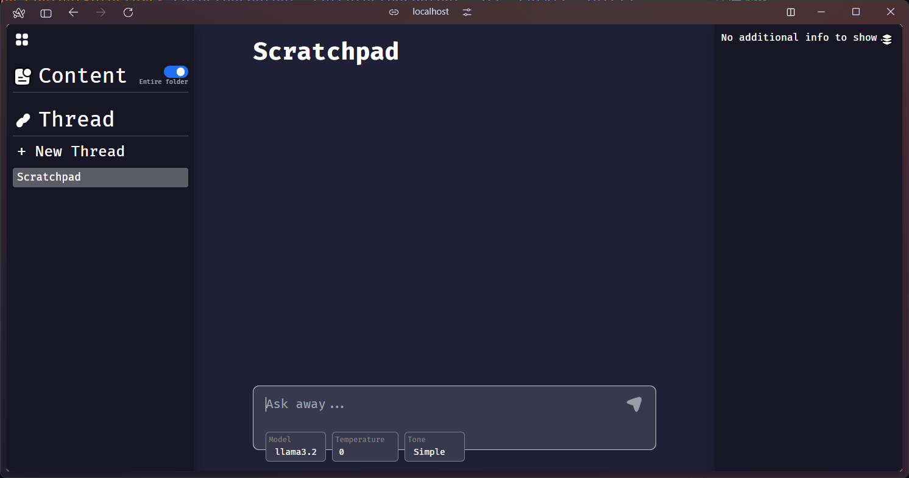

Plato is meant to help you get more out of your study sessions. This means, it can seamlessly and non-invasively integrate into your existing study folders.


Simply open up any folder. Open a terminal session here, and type:
```bash
plato init
```
to setup a plato project.

Next, type:
```bash
plato run
```
to open this project.


You should see a screen open up in a window of the default browser.



At this point, the project has been set up and ready to go.


